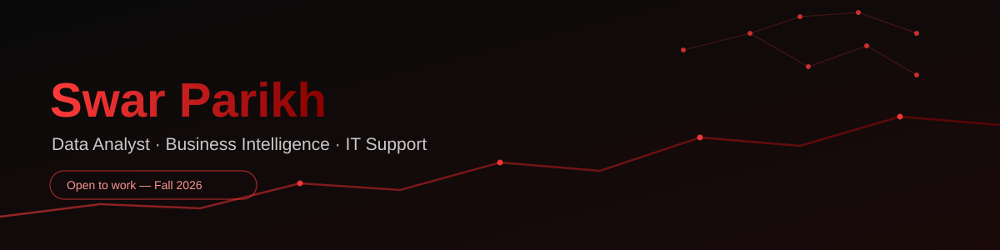

<div align="center">



[](https://git.io/typing-svg)

[](https://linkedin.com/in/swarparikh)
[](https://github.com/swarparikh)
[](mailto:parikhswar.work@gmail.com)
[](https://www.uwindsor.ca)

</div>

---

## 🧠 About Me

```python
class SwarParikh:
    location = "Ontario, Canada"
    degree   = "Master of Applied Computing @ University of Windsor (GPA: 3.5/4.0)"
    status   = "Seeking Data Analyst / IT Support roles (Fall 2026)"
    passion  = "Clean data, clean systems, decisions people can trust"

    skills = {
        "Visualization"  : ["Power BI", "Tableau", "Excel (Advanced)", "KPI Reporting"],
        "Languages"      : ["Python (Pandas, NumPy)", "SQL (Joins, Aggregations, Modeling)"],
        "Analytics/ML"   : ["scikit-learn", "Anomaly Detection", "Trend Analysis"],
        "Data Engineering": ["ETL Pipelines", "Data Modeling", "Data Validation", "SQL Server"],
        "IT Operations"  : ["System Monitoring", "SLA Tracking", "Incident Documentation",
                             "Compliance Reporting", "Service Desk Support"],
    }

    def current_goal(self):
        return "Land a role in Data Analytics, BI, or IT Support / Service Desk / Cloud Admin"
```

---

## 🛠️ Tech Stack

### Visualization & BI


### Languages & Query


### Analytics


### IT Operations & Tools


---

## 💼 Experience

| ORNGE Air Ambulance — IT Technical Analyst (Co-op) | V-Ex Tech Solution — Data Analyst Intern |
|---|---|
| **Jan 2026 – Aug 2026** · Mississauga, ON | **Jan 2024 – Apr 2024** · Vadodara, India |
| Monitored 100+ monthly service data points, sustaining **95% SLA compliance** | Automated SQL + Python ETL pipelines, cutting manual reporting time by **30%** |
| Built structured knowledge base documentation, reducing repeat incidents | Built Power BI and Tableau dashboards presented to senior stakeholders |
| Maintained audit-ready system records for compliance reviews in a regulated healthcare environment | Implemented data validation and cleansing protocols across enterprise sources |

---

## 🚀 Featured Projects

### Bank Loan Portfolio Risk Analytics
> Risk analytics pipeline on 38,600+ loan records

- Built a Python classification model achieving **86.2% accuracy** to flag portfolio risk patterns
- Developed a Power BI dashboard with DAX-driven KPIs and geospatial views for portfolio decision-making
- Repo: [Bank-Loan-Report-](https://github.com/swarparikh/Bank-Loan-Report-)

---

### Flight Delay Prediction System
> Regression pipeline over large-scale operational flight data

- Identified key delay drivers using Python, Pandas, and scikit-learn, evaluated via RMSE/MAE
- Delivered structured insights to support operational planning
- Repo: [Flight-Delay-Analysis](https://github.com/swarparikh/Flight-Delay-Analysis)

---

### Distributed File System via Socket Programming
> Systems-level project in C

- Implemented distributed file access over raw sockets, covering client-server architecture fundamentals
- Repo: [Distributed-File-System-via-Socket-Programming](https://github.com/swarparikh/Distributed-File-System-via-Socket-Programming)

More on GitHub: [India-Election-Analysis](https://github.com/swarparikh/India-Election-Analysis) · [IPL-Data-Analysis](https://github.com/swarparikh/IPL-Data-Analysis)

---

## 📚 Education

```
┌───────────────────────────────────────────────────────────────────────┐
│ Master of Applied Computing (MAC)                                     │
│   University of Windsor, Canada  |  GPA: 3.5 / 4.0                    │
│   Jan 2025 - Aug 2026  |  Windsor, ON                                 │
├───────────────────────────────────────────────────────────────────────┤
│ Bachelor of Engineering, Computer Science                              │
│   Babaria Institute of Technology, India  |  GPA: 3.6 / 4.0            │
│   Aug 2020 - May 2024  |  Vadodara, India                              │
└───────────────────────────────────────────────────────────────────────┘
```

---

## 🏅 Certifications


---

## 🌟 What I Bring to the Table

```
╔═════════════════════════╦═════════════════════════╦═════════════════════════╗
║      Analytics Core     ║     IT Operations       ║   Reliability Mindset   ║
╠═════════════════════════╬═════════════════════════╬═════════════════════════╣
║   SQL & Python Analysis ║   System Monitoring     ║  Audit-Ready Records    ║
║   Power BI & Tableau    ║   SLA / Ticket Tracking ║  Never Ship Bad Data    ║
║   Risk & Trend Scoring  ║   Service Desk Support  ║  Clear Documentation    ║
║   ETL & Data Validation ║   Compliance Reporting  ║  Cross-team Clarity     ║
╚═════════════════════════╩═════════════════════════╩═════════════════════════╝
```

---

## 📈 GitHub Analytics

<div align="center">


</div>

---

## 🤝 Let's Connect

<div align="center">

[](https://linkedin.com/in/swarparikh)
[](https://github.com/swarparikh)
[](mailto:swarparikhsv38@gmail.com)

<br/><br/>


</div>
